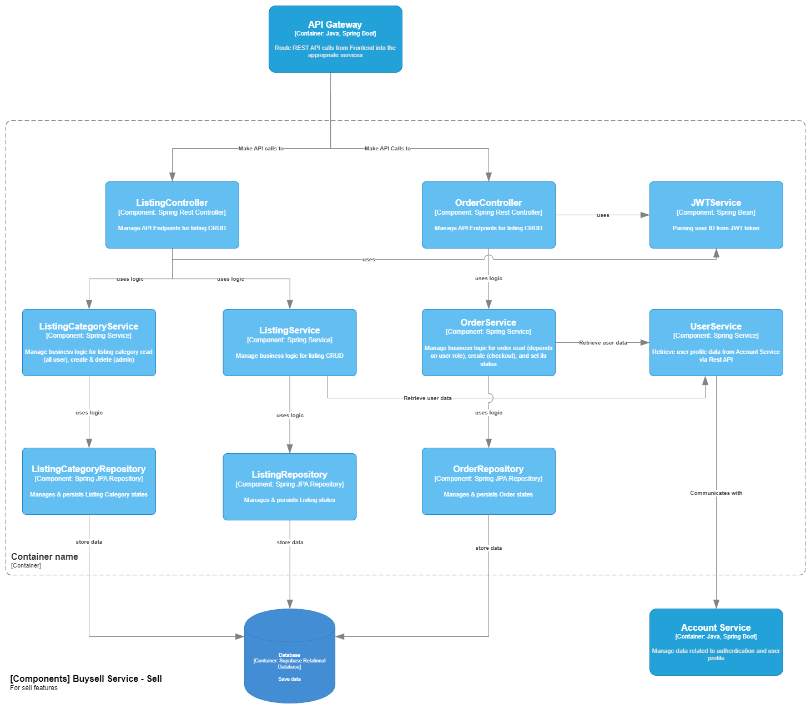
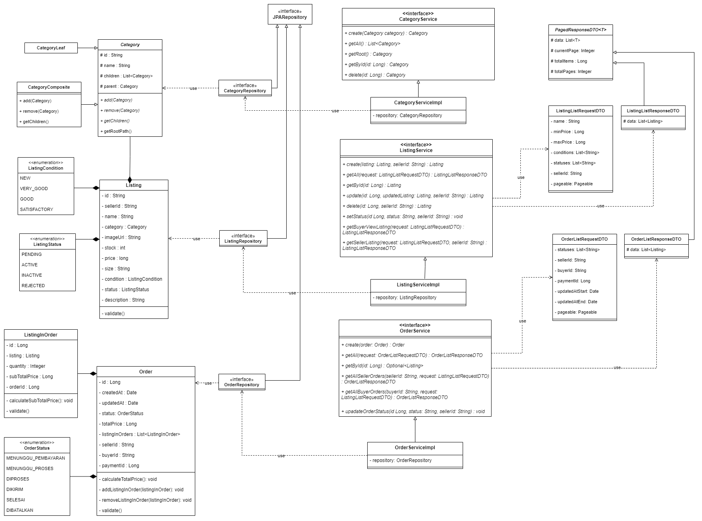

# FRONTEND FASHIONPEDIA

link deployment: [http://fashionpedia.my.id](http://fashionpedia.my.id)

Kelompok A2 :
- 2206081364 - Rafi Ghani Harditama
- 2206818966 - Sefriano Edsel Jieftara Djie
- 2006531005 - Nabil Muhammad Azzam
- 2206081194 - Ilham Abdillah Alhamdi
- 2206024713 - Fredo Melvern Tanzil

## Current Architecture

### Context Diagram

### Container Diagram

### Deployment Diagram

### Component Diagram
Contributed by:
- Nabil Muhammad Azzam

#### 1 - Account Service (Auth + Profile)

#### 2 - Payment Service (Bagian approval oleh staff)
Contributed by:
- Nabil Muhammad Azzam

#### 3 - Buysell Service (Bagian Fitur Buy)
Contributed by:
- Fredo Melvern Tanzil  

#### 4 - Buysell Service (Bagian Fitur Sell)
Contributed by:
- Ilham Abdillah Alhamdi  

- Rafi Ghani Harditama
- Sefriano Edsel Jieftara Djie

### Code Diagram

#### 1 - Account Service (Auth + Profile)
Contributed by:
- Nabil Muhammad Azzam

#### 2 - Buysell Service (Bagian Fitur Buy)
Contributed by:
- Fredo Melvern Tanzil

#### 3 - Buysell Service (Bagian Fitur Sell)
Contributed by:
- Ilham Abdillah Alhamdi

- Rafi Ghani Harditama
- Sefriano Edsel Jieftara Djie

### Risk Analyzing
Tabel Risk Assesment:

Penjelasan:

Tabel Context Diagram Redraw:

Discuss it and the write a well written an concise explanation why the risk storming technique is applied. Write it your Readme.md project repository. 
Explanation storming technique, risk analysis, architecture modification justification: 

RISK ANALYSIS

The risk analysis was performed to identify critical areas of the application's performance. Using risk matrix and storming between member of the team, the identification attempt was made through 3 phases : identification, consensus, and mitigation. Through these phases, our team agrees, as part of the mitigation process, to add some modification to the architecture. The modification was to add load balancers and separating the database for each service. The justification for the decision was given below.

ARCHITECTURE MODIFICATION JUSTIFICATION

A. Addition of Load Balancers

As an ecommerce web application, Fashionpedia may have large traffic in the future. The traffic it self may not evenly distributed between services. Some noticeabel services that may prone to large traffic included Authentication service, simply due to many user Authenticating and accessing resource, and order service to anticipate the large amount of order made by user and processed.

B. Enabling one Database for Each Services

In current implementation, all services connect to one database. This practice was prone to devops, for example if one wanted to change or perform update to the database. This was also, architecturally, wasnt modular. A better implementation was to separate the database for each service.

Tabel Container Diagram Redraw:

