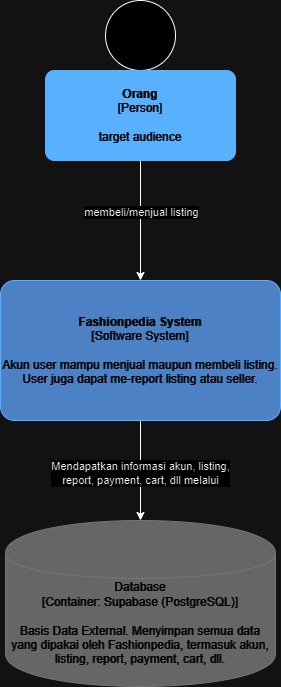

## FRONTEND FASHIONPEDIA

link deployment: [http://fashionpedia.my.id](http://fashionpedia.my.id)

Kelompok A2 :
- 2206081364 - Rafi Ghani Harditama
- 2206818966 - Sefriano Edsel Jieftara Djie
- 2006531005 - Nabil Muhammad Azzam
- 2206081194 - Ilham Abdillah Alhamdi
- 2206024713 - Fredo Melvern Tanzil

### Current Architecture

Context Diagram

Container Diagram

Deployment Diagram

Component Diagram
- Rafi Ghani Harditama

- Sefriano Edsel Jieftara Djie

- Nabil Muhammad Azzam

- Ilham Abdillah Alhamdi

- Fredo Melvern Tanzil

Code Diagram
- Rafi Ghani Harditama

- Sefriano Edsel Jieftara Djie

- Nabil Muhammad Azzam

- Ilham Abdillah Alhamdi

- Fredo Melvern Tanzil

### Risk Analyzing
Tabel Risk Assesment:

Penjelasan:

Tabel Context Diagram Redraw:

Discuss it and the write a well written an concise explanation why the risk storming technique is applied. Write it your Readme.md project repository. 
Explanation storming technique, risk analysis, architecture modification justification: <insert here>

Tabel Container Diagram Redraw:
